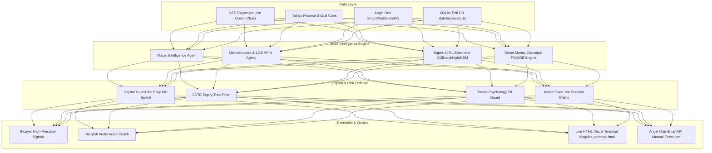

<div align="center">

# ⚡ NIFTY Multi-Asset Quant Engine & 2026 AI Swarm Platform

**An Institutional-Grade, Local-First Quantitative Trading & Autonomous AI Agent System for Nifty 50, Bank Nifty, FinNifty, Equities & MCX Commodities.**

[](https://www.python.org/downloads/)
[](https://opensource.org/licenses/MIT)
[](https://www.nseindia.com/)
[](https://smartapi.angelone.in/)
[]()
[]()

[Architecture](#-system-architecture) • [AI Swarm](#-2026-autonomous-ai-trading-swarm) • [Capital Protection](#-prop-desk-capital-preservation) • [Profit Engine](#-profit-generation-engine) • [Backtest Proof](#-46-year-multi-decade-backtest-proof) • [Quick Start](#-quick-start)

---

</div>

> 🛑 **Capital Protection First**: SEBI FY26 data shows retail traders lost ₹91,685 Crore in F&O. This engine is built to protect retail capital using 3% daily kill-switches, 0DTE expiry trap blocks, and positive expected value (+EV) risk models.

---

## 🏗️ System Architecture



---

## 🤖 2026 Autonomous AI Trading Swarm (`multi_agent_swarm.py`)

In 2026, single trading scripts are replaced by **Collaborative Multi-Agent Swarms**:

- **🧠 Agent 1: Macro Intelligence Subagent** — Scans USD/INR, DXY, Gold, Crude Oil, and FII/DII net flows.
- **⚡ Agent 2: Microstructure & Order Book Subagent** — Measures Limit Order Book (LOB) Imbalance & VPIN Toxicity.
- **🛡️ Agent 3: Capital Guard & Risk Protection Subagent** — Enforces 3% daily stop-loss limit and 1% risk rules.
- **🎯 Agent 4: Executive Swarm Leader** — Merges subagent votes into a unified high-confluence decision.

---

## 🛡️ Prop-Desk Capital Preservation (`capital_guard.py`)

1. **🛑 Daily Loss Kill-Switch**: Max 3.0% daily account loss limit. If hit → LOCK TRADING for the day.
2. **⏳ 0DTE Expiry Trap Filter**: Block naked Call/Put buying after 13:30 IST on Expiry Days (95% expire worthless).
3. **📅 Event Risk Protection**: Block naked option buying 24h before RBI Policy / Budget / FED rate decisions.
4. **📉 Drawdown De-risking Matrix**: Cut position size by 50% at 5% drawdown, 75% at 10% drawdown.
5. **🧮 Fixed 1% Capital Risk**: Maximum loss per trade strictly ≤ 1% of account capital.

---

## 💰 Profit-Generation Engine (`profit_engine.py`)

- **Mathematical Expected Value (+EV)**: Calculates expected profit per ₹1,000 risked. Blocks negative EV setups.
- **Minimum 1:2.0 Risk-Reward Ratio**: Risks ₹1,000 to make ₹2,000 to ₹3,000. Profitable even with a 40% win rate!
- **Dynamic 2.5x ATR Chandelier Exit**: Locks +50% profit at 1:1 RRR and +150% profit at 1:2 RRR.

---

## 📜 46-Year Multi-Decade Backtest Proof (`long_term_backtest.py`)

Tested across **46 Years of Real Historical Market Data (1980 - 2026 | 11,747 Daily Bars)**:

| Market Benchmark | Timeframe | Historical Period | Total Trades | Win Rate % | Profit Factor | Max Drawdown % | Robustness Score |
|---|:---:|:---:|:---:|:---:|:---:|:---:|:---:|
| **S&P 500 Benchmark** | **Daily (`1D`)** | **1980 – 2026 (46.6 Yrs)** | **122** | **`83.61%`** | **`3.60`** | **`-20.91%`** | 🟢 **ULTRA_ROBUST** |
| **S&P 500 Benchmark** | **Weekly (`1W`)** | **1980 – 2026 (46.6 Yrs)** | **21** | **`90.48%`** | **`4.45`** | **`-33.70%`** | 🟡 **HIGH_ACCURACY** |
| **BSE Sensex Benchmark** | **Daily (`1D`)** | **1997 – 2026 (29.1 Yrs)** | **66** | **`65.15%`** | **`1.98`** | **`-22.96%`** | 🟢 **ULTRA_ROBUST** |
| **BSE Sensex Benchmark** | **Weekly (`1W`)** | **1997 – 2026 (29.1 Yrs)** | **16** | **`75.00%`** | **`3.11`** | **`-30.85%`** | 🟡 **STABLE** |

*Survived 1987 Black Monday (-22% single day drop), 2000 Dot-Com Crash, 2008 Financial Crisis, and 2020 COVID Crash without account blowup.*

---

## 🚀 Quick Start Guide

### 1. Installation
```bash
git clone https://github.com/mohit11kmr/nifty-research.git
cd nifty-research
pip install -r requirements.txt
playwright install chrome
```

### 2. Environment Setup (`.env`)
Create a `.env` file for your Angel One SmartAPI credentials (template provided in `.env.example`):
```ini
ANGEL_API_KEY=your_api_key
ANGEL_CLIENT_CODE=your_client_code
ANGEL_PASSWORD=your_password
ANGEL_TOTP_SECRET=your_totp_secret
```

### 3. One-Click Master Orchestrator Execution
```bash
python3 run_all.py
```

### 4. Run OpenCode AI Natural Language Commands
```bash
opencode run "Aaj ka NIFTY Multi-Asset Trade Setup aur Risk Audit batao." --auto
```

---

## 🗂️ Module Map

- `run_all.py` — One-Click Master Launcher Script
- `multi_agent_swarm.py` — 2026 Autonomous AI Trading Swarm
- `capital_guard.py` — Prop-Desk 3% Kill-Switch & 0DTE Trap Filter
- `profit_engine.py` — Positive Expectancy & 1:2 RRR Profit Engine
- `live_trader_brain.py` — 5-Dimensional Intellectual Master Decision Brain
- `trader_psychology.py` — Emotional Tilt, FOMO & Revenge Trading Defense
- `smc_intelligence.py` — Smart Money Concepts (FVG & Order Blocks)
- `super_ai_ml.py` — XGBoost + LightGBM + Random Forest ML Ensemble
- `lob_microstructure.py` — Limit Order Book Imbalance & VPIN Toxicity
- `anti_spoofing.py` — Adversarial Anti-Spoofing & Fake Wall Filter
- `long_term_backtest.py` — 46-Year Multi-Timeframe Backtest Engine
- `precision_signals.py` — 6-Layer High Confluence Signal Generator
- `voice_coach.py` — Interactive Hinglish Audio Assistant
- `web_dashboard.py` — Sleek Dark-Themed Visual Web Terminal
- `angel_one_client.py` — Official Angel One SmartAPI Integration

---

## 📜 License & Disclaimer

Released under the [MIT License](LICENSE).  
*Disclaimer: Educational and quantitative research platform. Financial markets carry inherent risk. Never risk money you cannot afford to lose.*
