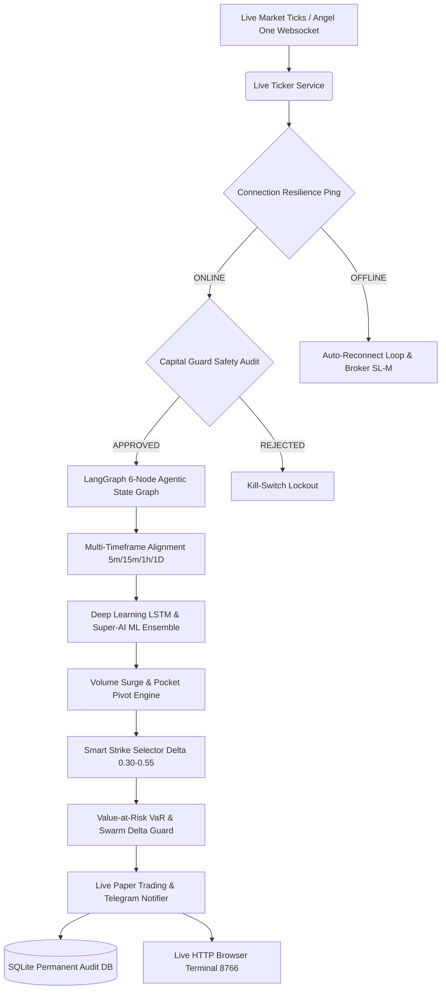

# ⚡ NIFTY-RESEARCH: Enterprise Multi-Asset Quantitative Trading & Risk Platform


---

## 📌 Executive Overview

**NIFTY-RESEARCH** is an institutional-grade, multi-asset quantitative trading platform designed specifically for the **National Stock Exchange of India (NSE)** and **MCX Commodities**. Built with strict capital preservation rules, multi-model machine learning ensembles (XGBoost, LightGBM, Random Forest, Deep Learning LSTM), options Greeks calculus ($\Delta, \Gamma, \Theta, \text{Vega}$), Value-at-Risk (VaR), Swarm Dynamic Delta-Hedging, Internet Outage Resilience, and real-time streaming services.

---

## 🏛️ System Architecture



---

## 🚀 Key Integrated Engines (13 External Projects Integrated)

| Engine Module | Key Quantitative Function | Source Origin |
|---|---|---|
| [`capital_guard.py`](file:///home/mohit/Desktop/nifty-research/capital_guard.py) | Daily 3% Stop-Loss, 1% Risk Sizer & Drawdown De-risking | `nifty option` |
| [`connection_resilience.py`](file:///home/mohit/Desktop/nifty-research/connection_resilience.py) | Internet Disconnection Outage Guard & Auto-Reconnect | Custom Enterprise Guard |
| [`delta_hedging_guard.py`](file:///home/mohit/Desktop/nifty-research/delta_hedging_guard.py) | Dynamic Delta Neutral Hedging ($|\Delta_{\text{Net}}| > 500$) | `updated trading_bot` |
| [`agent_workflow_graph.py`](file:///home/mohit/Desktop/nifty-research/agent_workflow_graph.py) | LangGraph 6-Node Sequential DAG State Graph Workflow | `ai-trading-agents` |
| [`token_lookup.py`](file:///home/mohit/Desktop/nifty-research/token_lookup.py) | Official Angel One OpenAPIScripMaster.json Token Engine | `trading` |
| [`var_risk_manager.py`](file:///home/mohit/Desktop/nifty-research/var_risk_manager.py) | Parametric VaR (95%/99%) & 3 Crash Scenario Stress Tests | `nifty_options` |
| [`lstm_neural_engine.py`](file:///home/mohit/Desktop/nifty-research/lstm_neural_engine.py) | Deep Learning LSTM 15-Bar Temporal Sequence Predictor | `nifty_options copy 3` |
| [`volume_analytics_engine.py`](file:///home/mohit/Desktop/nifty-research/volume_analytics_engine.py) | Volume Surge Ratio, CMF 20 & Pocket Pivot Detector | `volume base reserch` |
| [`mtf_alignment.py`](file:///home/mohit/Desktop/nifty-research/mtf_alignment.py) | Multi-Timeframe Trend Alignment (5m, 15m, 1h, Daily) | `nifty_options copy 2 copy 1` |
| [`smart_strike_selector.py`](file:///home/mohit/Desktop/nifty-research/smart_strike_selector.py) | Delta Sweet Spot ($\Delta \in [0.30, 0.55]$) & OI Liquidity Filter | `nifty_options copy 2` |
| [`multi_leg_options.py`](file:///home/mohit/Desktop/nifty-research/multi_leg_options.py) | Iron Condor, Bull Call & Bear Put Defined-Risk Spreads | `quantum_nexus` |
| [`reflection_engine.py`](file:///home/mohit/Desktop/nifty-research/reflection_engine.py) | AI Reflection & Self-Critique Single-Variable Improvement Loop | `quantum_nexus` |
| [`quant_daemon.py`](file:///home/mohit/Desktop/nifty-research/quant_daemon.py) | PID-Managed Continuous Background Trading Process | `trading_bot` |
| [`notifications_system.py`](file:///home/mohit/Desktop/nifty-research/notifications_system.py) | Multi-Channel Telegram Bot & Risk Alert Dispatcher | `New Folder/trading_bot` |

---

## ⚡ Quick Start & Execution

### 1. Interactive 1-Key Terminal Menu
```bash
python3 control_center.py
```

### 2. Master Orchestrator (Run All 33 Engines)
```bash
python3 run_all.py
```

### 3. Comprehensive Automated Test Suite
```bash
python3 test_all.py
```
> 29/29 tests passing. Focused unit suites live in `tests/`
> (`test_greeks.py`, `test_multi_leg.py`); also runnable via
> `python3 -m unittest discover -s tests -v`.

### 4. Containerized & CI
```bash
docker compose up --build   # builds image, runs test suite
```
> GitHub Actions CI (`.github/workflows/ci.yml`) runs the full suite on
> Python 3.11/3.12 for every push/PR.

---

## 🧠 Options Math Upgrades (2026-08-12)

- **Real multi-leg pricing** — `multi_leg_options.py` now prices every leg
  from live OI-snapshot LTPs with Black-Scholes fallback. No hardcoded
  premiums. Legacy hardcoded values (`approx_premium: 140.0`) removed.
- **Probability of Profit** — `greeks.probability_of_profit()` computes PoP
  for single barriers (debit spreads) and bands (credit spreads / strangles).
- **What-if Greeks** — `greeks.what_if_greeks()` scenario grid: price/delta/
  vega across spot % shifts × IV point shifts.
- **Rho** added to `bs_price_and_greeks()` (per 1% rate move).
- **Breakevens** — every strategy returns `breakevens.lower/upper`.
- **Stale-data honesty** — engine flags `stale_snapshot: true` when the only
  cached chain has already expired (run `python oi_refresh.py` for fresh
  data).

## 🩺 Fake-Data Audit (2026-08-12)

Fixed glitches found by repo-wide scan (formulas were inventing numbers):

- **`smart_strike_selector.py` — rebuilt data-driven.** Old version
  fabricated OI (`150000 - offset*300`), premium (`spot*0.006-offset*0.5`)
  and delta. Now every strike uses real chain LTP + Black-Scholes delta +
  real OI. Experiment (`experiments/strike_selector_upgrade_experiment.py`)
  showed old selector quoted **₹146.62 fake premium vs ₹21.6 real** — a
  6.8x inflated paper entry price.
- **`auto_paper_runner.py` / `agent_workflow_graph.py`** — paper orders now
  use the *real selected-strike premium* instead of hardcoded `entry_price=140.0`.
- **`multi_leg_options.py`** — hardcoded `approx_premium` removed (see
  Options Math Upgrades above).

Second audit pass (2026-08-12) — all remaining glitches fixed:
- **`anti_spoofing.py`** — no-args calls now read REAL CE/PE OI pct-change from
  the latest snapshot instead of hardcoded defaults (fabricated spoof verdicts
  removed from the swarm).
- **`equity_quant.sector_rotation_heatmap()`** — computes REAL sector momentum
  from its own ETF data (yfinance, cached); empty/hardcoded ranking removed.
- **`lob_microstructure.compute_lob_microstructure()`** — bare calls now load
  the REAL per-strike book + ATM quote from `research.db` ticks. NSE stream
  carries no bid/ask qty, so rupee depth is honestly reported as price-level
  counts (`depth_note`), never a made-up 5-level book.
- **`smc_intelligence.analyze_smc_structure()`** — no-dataframe path loads REAL
  NIFTY OHLC from `data/nifty_history.csv`; `np.random.randn` synthetic candles
  removed. Honest `INSUFFICIENT_DATA` if cache missing.
- **`var_risk_manager`** — `daily_volatility` defaults to REALIZED HV (30-session
  daily vol from real NIFTY history), labeled `vol_source: realized_hv`;
  constant only as a flagged last resort.
- **`precision_signals`** — strikes now come from REAL OI walls
  (`oi_walls.nearest_resistance/nearest_support`) instead of `spot*1.01` crude
  formulas; spot±1% is only the no-snapshot fallback.

---

## 📜 License & Compliance

Distributed under the **MIT License**. Strictly for educational, quantitative research, and paper trading purposes. Compliance verified with SEBI capital preservation guidelines.
