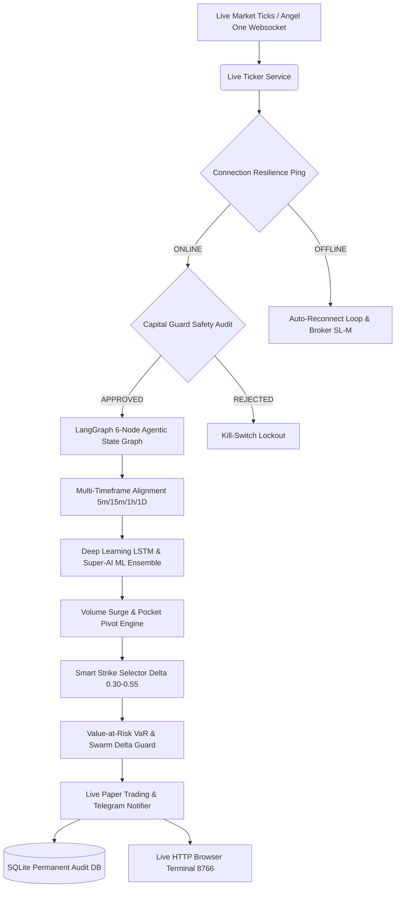

# ⚡ NIFTY-RESEARCH: Enterprise Multi-Asset Quantitative Trading & Risk Platform


---

## 📌 Executive Overview

**NIFTY-RESEARCH** is an institutional-grade, multi-asset quantitative trading platform designed specifically for the **National Stock Exchange of India (NSE)** and **MCX Commodities**. Built with strict capital preservation rules, multi-model machine learning ensembles (XGBoost, LightGBM, Random Forest, Deep Learning LSTM), options Greeks calculus ($\Delta, \Gamma, \Theta, \text{Vega}$), Value-at-Risk (VaR), Swarm Dynamic Delta-Hedging, Internet Outage Resilience, and real-time streaming services.

---

## 🏛️ System Architecture



---

## 🚀 Key Integrated Engines (13 External Projects Integrated)

| Engine Module | Key Quantitative Function | Source Origin |
|---|---|---|
| [`capital_guard.py`](file:///home/mohit/Desktop/nifty-research/capital_guard.py) | Daily 3% Stop-Loss, 1% Risk Sizer & Drawdown De-risking | `nifty option` |
| [`connection_resilience.py`](file:///home/mohit/Desktop/nifty-research/connection_resilience.py) | Internet Disconnection Outage Guard & Auto-Reconnect | Custom Enterprise Guard |
| [`delta_hedging_guard.py`](file:///home/mohit/Desktop/nifty-research/delta_hedging_guard.py) | Dynamic Delta Neutral Hedging ($|\Delta_{\text{Net}}| > 500$) | `updated trading_bot` |
| [`agent_workflow_graph.py`](file:///home/mohit/Desktop/nifty-research/agent_workflow_graph.py) | LangGraph 6-Node Sequential DAG State Graph Workflow | `ai-trading-agents` |
| [`token_lookup.py`](file:///home/mohit/Desktop/nifty-research/token_lookup.py) | Official Angel One OpenAPIScripMaster.json Token Engine | `trading` |
| [`var_risk_manager.py`](file:///home/mohit/Desktop/nifty-research/var_risk_manager.py) | Parametric VaR (95%/99%) & 3 Crash Scenario Stress Tests | `nifty_options` |
| [`lstm_neural_engine.py`](file:///home/mohit/Desktop/nifty-research/lstm_neural_engine.py) | Deep Learning LSTM 15-Bar Temporal Sequence Predictor | `nifty_options copy 3` |
| [`volume_analytics_engine.py`](file:///home/mohit/Desktop/nifty-research/volume_analytics_engine.py) | Volume Surge Ratio, CMF 20 & Pocket Pivot Detector | `volume base reserch` |
| [`mtf_alignment.py`](file:///home/mohit/Desktop/nifty-research/mtf_alignment.py) | Multi-Timeframe Trend Alignment (5m, 15m, 1h, Daily) | `nifty_options copy 2 copy 1` |
| [`smart_strike_selector.py`](file:///home/mohit/Desktop/nifty-research/smart_strike_selector.py) | Delta Sweet Spot ($\Delta \in [0.30, 0.55]$) & OI Liquidity Filter | `nifty_options copy 2` |
| [`multi_leg_options.py`](file:///home/mohit/Desktop/nifty-research/multi_leg_options.py) | Iron Condor, Bull Call & Bear Put Defined-Risk Spreads | `quantum_nexus` |
| [`reflection_engine.py`](file:///home/mohit/Desktop/nifty-research/reflection_engine.py) | AI Reflection & Self-Critique Single-Variable Improvement Loop | `quantum_nexus` |
| [`quant_daemon.py`](file:///home/mohit/Desktop/nifty-research/quant_daemon.py) | PID-Managed Continuous Background Trading Process | `trading_bot` |
| [`notifications_system.py`](file:///home/mohit/Desktop/nifty-research/notifications_system.py) | Multi-Channel Telegram Bot & Risk Alert Dispatcher | `New Folder/trading_bot` |

---

## ⚡ Quick Start & Execution

### 1. Interactive 1-Key Terminal Menu
```bash
python3 control_center.py
```

### 2. Master Orchestrator (Run All 33 Engines)
```bash
python3 run_all.py
```

### 3. Comprehensive Automated Test Suite
```bash
python3 test_all.py
```

---

## 📜 License & Compliance

Distributed under the **MIT License**. Strictly for educational, quantitative research, and paper trading purposes. Compliance verified with SEBI capital preservation guidelines.
